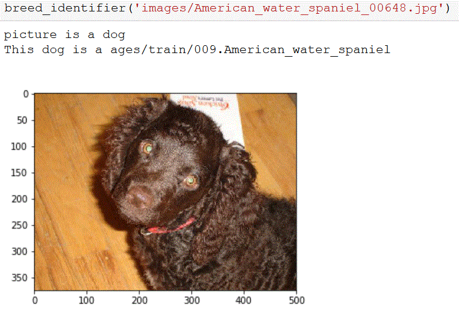
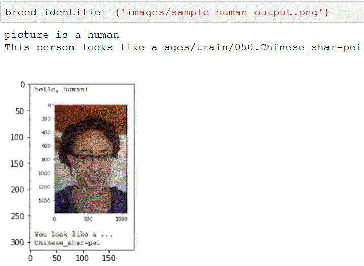

# Dog Breed Classifier
This work is part of Udacity’s Data Science capstone project. 

## project overview
The goal is to create a pipeline that detects dog images and classifies them according to their breed using CNN . This model can be used as part of a mobile or web app for real world and user provided images.Given an image to the model, it will return if an image includes dog and an estimation of breed. If the image is not a dog, it will return the resembling dog breed. You can read more about this work in my blog here.

## contents of ipynb notebook:
    Step 0: Import Datasets
    Step 1: Detect Humans
    Step 2: Detect Dog
    Step 3: Create a CNN to Classify Dog Breeds (from Scratch)
    Step 4: Create a CNN to Classify Dog Breeds (using Transfer Learning)
    Step 5: Write the Algorithm
    Step 6: Test the Algorithm

## Data
You can download the dog and human data sets 

## Dog and human detector
I used OpenCV’s implementation of Haar feature-based cascade object classifier to detect human faces in images. But first the images have to be converted to grayscale before using the detector. This detector has a 11% false positive rate tested on 100 sample dog images. So, I used pretrained ResNet_50 weights in keras to detect dog from images. If the predicted class of RestNet50 on ImageNet falls into the dog breed categories dog detector performs well and if not we should use another keras models as dog detector. But, it performed well without false positive. 

## Dog classifier
Here I created a 4-layer CNN in Keras that classifies dog breeds, but the accuracy is about 12% which is a little better than random guessing. So, I leveraged the latest state of art techiniques like VGG, Inception V3, and ResNet to classify dogs. The Exception model outperforms all the other models with the accuracy of 86%. 

## Files
extract_bottleneck_features.py - Some functions to process the pretrained models.

haarcascades - A folder containing the filters we will use in the human face detector.

images - A folder to place any images on which you would like to test the model.

requirements - A folder containing the necessary dependencies.

saved_models - A folder in which to save any models you train.

dog_app.ipynb - A jupyter notebook in which the code can be found.

## Results 
The state-of-art Covnet models I implemented are VGG19, InceptionV3, ResNet50 and Xception. For each one, I downloaded the pretrained weights, and freezed all the pre-trained layers. The first fine tuning approach I used was to change the last fully connected layer to the number of dog breeds. 
The Exception and Resnet50 models outperforms all the other models with the accuracy of almost 86%.  
In general, Xception slightly outperforms InceptionV3 and Resnet on ImageNet dataset, also it is more computationally efficient. 

The followings are the classifier outputs:

## Libraries 
    opencv-python==3.2.0.6
    h5py==2.6.0
    matplotlib==2.0.0
    numpy==1.12.0
    scipy==0.18.1
    tqdm==4.11.2
    keras==2.0.2
    scikit-learn==0.18.1
    tensorflow==1.0.0
